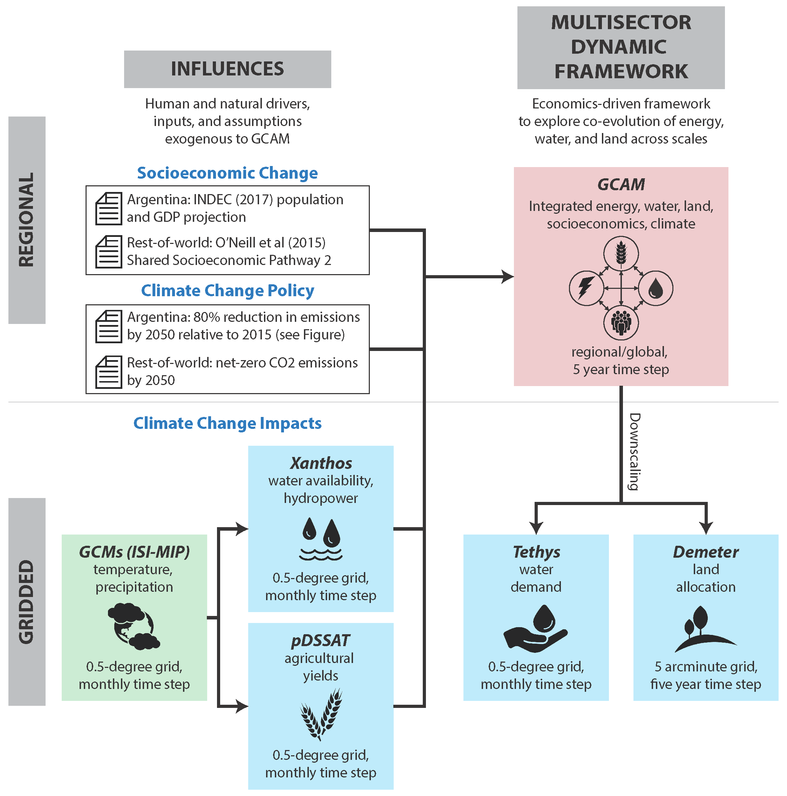

# ArgentinaNexus
<!--your zenodo badge here-->

<br />

<!-------------------------->
<!-------------------------->
## Contents
<!-------------------------->
<!-------------------------->
- [Abstract](#abstract)
- [Code Reference](#code-reference)
- [Journal Reference](#journal-reference)
- [Contributing Models](#contributing-models)
- [Data Reference](#data-reference)
- [Reproduce My Experiment](#reproduce-my-experiment)

<br />

<!-------------------------->
<!-------------------------->
## Abstract
<!-------------------------->
<!-------------------------->

In this stakeholder-driven study, Argentina serves as a testbed for demonstrating that integrated energy-water-land (EWL) nexus planning has the potential to identify future challenges and opportunities in ways that traditional, sector-specific planning approaches cannot. We search across sectors and scales in Argentina to identify nexus hotspots in which potential EWL conflicts may emerge due to a confluence of multi-scale human and natural system forces, including socioeconomic change, climatic change, and climate policy (i.e., mid-century strategies to dramatically reduce carbon emissions). To capture national, regional, and sub-regional EWL dynamics in a global context, the scenario-driven modeling framework we use couples the Global Change Analysis Model with a suite of globally consistent sectoral downscaling models to conditionally project the regional and sub-regional EWL implications of regional-to-global change. Across the scenarios we explored, increasing demand for agricultural commodities such as oil crops (e.g., soy) and biomass, in both domestic and international markets, is projected to drive large-scale changes in regional land use and corresponding increases in water demands. This change is projected to disproportionately affect a subset of river basins in Argentina, including the Colorado, Negro, and Bermejo basins. In the very same basins, climate change is expected to reduce physical water availability. This confluence of multi-scale human (increased water demand) and natural (reduced water availability) forces could combine to drive the emergence of moderate-to-severe water scarcity hotspots that could benefit from the adoption of integrated planning approaches.

[Back to Contents](#contents)

<br />

<!-------------------------->
<!-------------------------->
## Code Reference
<!-------------------------->
<!-------------------------->

[1] **Metis:** Khan, Z., Wild, T., Vernon, C., Miller, A., Hejazi, M., Clarke, L., Miralles-Wilhelm, F., Castillo, R.M., Moreda, F., Bereslawski, J.L., Suriano, M. and Casado, J., (2020). Metis v1.1.0. Github. [](https://github.com/JGCRI/metis/releases/tag/v1.0.0)


[2] **GCAM:** Khan, Zarrar. (2019, November 5). gcam-v5.1.3LAC_khan_et_al_2020_Uruguay (Version 5.3.1LAC). Zenodo. [](https://doi.org/10.5281/zenodo.3897519)

[3] **Xanthos:** Braun Caleb, Vernon Chris, Link Robert, Evanoff Jason, & Khan Zarrar. (2020, December 30). xanthos-v2.3.1 for Wild_et_al_2020_ArgentinaNexus (Version v2.3.1-wild2020-ArgentinaNexus). Zenodo. [](https://doi.org/10.5281/zenodo.4404834)

[4] **Demeter:** Vernon Chris, & Braun Caleb. (2020, December 30). demeter-v1.1.0 for Wild_et_al_2020_ArgentinaNexus (Version v1.1.0-wild2020-ArgentinaNexus). Zenodo. [](https://doi.org/10.5281/zenodo.4404738)

[5] **Tethys:** Vernon Chris, Link Robert, & Braun Caleb. (2020, December 31). tethys-v1.2.0 for Wild_et_al_2020_ArgentinaNexus (Version v1.2.0-wild2020-ArgentinaNexus). Zenodo. [](https://doi.org/10.5281/zenodo.4405008)


[Back to Contents](#contents)

<br />

<!-------------------------->
<!-------------------------->
## Journal Reference
<!-------------------------->
<!-------------------------->
Update your journal reference here after acceptance.

[Back to Contents](#contents)

<br />

<!-------------------------->
<!-------------------------->
## Contributing Models
<!-------------------------->
<!-------------------------->

Please note that the models used in this research are the versions labeled in [Table 1](#table1).

<a name="table1"></a>
**Table 1:** Model repository and DOI links.

| Model | Version | Repository Link | DOI |
|:-:|:-:|---|---|
| Xanthos | <v2.3.1> | <https://github.com/mengqi-z/xanthos/tree/v2.3.1-wild2020-ArgentinaNexus> | <https://doi.org/10.5281/zenodo.4404834> |
| pDSSAT | <version> | <link to code repository> | <DOI link> |
| GCAM | <v5.1.3LAC> | <https://doi.org/10.5281/zenodo.3897519> | <https://doi.org/10.5281/zenodo.3897519> |
| Tethys | <v1.2.0> | <https://github.com/mengqi-z/tethys/tree/v1.2.0-wild2020-ArgentinaNexus> | <http://doi.org/10.5281/zenodo.4405008> |
| Demeter | <v1.1.0> | <https://github.com/mengqi-z/demeter/tree/v1.1.0-wild2020-ArgentinaNexus> | <https://doi.org/10.5281/zenodo.4404738> |

[Back to Contents](#contents)

<br />

<!-------------------------->
<!-------------------------->
## Data Reference
<!-------------------------->
<!-------------------------->

### 1. Input Data

#### Forcing Data
In the study of Argentina Energy-Water-Land systems, we selected one climate impact scenario from Global Climate Model (GCM) MIROC-ESM-CHEM forced by Representative Concentration Pathway (RCP) 6.0. The source of climate data for Xanthos is obtained from ISIMIP Fast Track Dataset (citation). Input data for GCAM, Demeter, and Tethys are outputs from their feeding models described in [Figure 1](#figure1). Generally, those outputs need to be post-processed to required formats in order to feed into other models as inputs. We provide R scripts in section [Reproduce My Experiment](#reproduce-my-experiment) for reproducing the post-processed input data.

For broader use of these data, we also provide post-processed input dataset directly (See DOI link in [Table 2](#table2)). These data includes all 20 combinations of GCM/RCP scenarios. There are 5 GCMs (i.e., GFDL-ESM2M, HadGEM2-ES, IPSL-CM5A-LR, MIROC-ESM-CHEM, and NorESM1-M) and 4 RCPs (i.e., rcp2.6, rcp4.5, rcp6.0, and rcp8.5).

<a name="table2"></a>
**Table 2:** Input data for each model and DOI links.

| Input Data Category | Model | DOI | Description |
|---|---|---|---|
| Climate | Xanthos | <link to DOI dataset> | [NPY files] 20 GCM/RCP climate projections. |
| Hydrobiologic Data | GCAM | <http://doi.org/10.5281/zenodo.4420154> | [XML files] created from Xanthos and AgYield outputs, including runoff, hydropower, and crop yields. |
| Projected Land Allocation | Demeter | <http://doi.org/10.5281/zenodo.4420156> | [CSV files] created from land use land cover projection from GCAM output. |
| GCAM database | Tethys | <http://doi.org/10.5281/zenodo.4420154> | [basex files] created from GCAM runs by GCM. Each GCM run includes 8 combinations from 4 rcps and 2 scenarios (i.e., Climate Impacts scenario and Policy scenario) |

#### Files Replaced for Argentina Study
For the Argentina study, we replaced default files of each model with modified files we provide in [Table 3](#table3). For configuration and model run files, you will need to modify the directories based on the location of your models. More detailed summary of data and files can be found in [File Replacement Record](docs/summary_modified_files.md).

<a name="table3"></a>
**Table 3:** Files replaced for model modifications in the Argentina Nexus study.

| File Category | Model | Directory |
|---------------|-------|-----------|
| Runoff Module | Xanthos | ArgentinaNexus/DataFiles/Xanthos/example/input/runoff |
| Xanthos Configuration and Model Run | Xanthos | ArgentinaNexus/DataFiles/Xanthos/example |
| GCAM Configuration and Batch Files | GCAM | ArgentinaNexus/DataFiles/GCAM |
| IDB | GCAM | ArgentinaNexus/DataFiles/GCAM/input/idb |
| Allocation | Demeter | ArgentinaNexus/DataFiles/Demeter/example/inputs/allocation |
| Constraints | Demeter | ArgentinaNexus/DataFiles/Demeter/example/inputs/constraints |
| Observation | Demeter | ArgentinaNexus/DataFiles/Demeter/example/inputs/observed |
| Reference | Demeter | ArgentinaNexus/DataFiles/Demeter/example/inputs/reference |
| Demeter Configuration | Demeter | ArgentinaNexus/DataFiles/Demeter/example |
| Region Grids | Tethys | ArgentinaNexus/DataFiles/Tethys/example/Input/harmonized_inputs |
| Region Names | Tethys | ArgentinaNexus/DataFiles/Tethys/example/Input/rng33 |
| Livestock Fraction | Tethys | ArgentinaNexus/DataFiles/Tethys/example/Input/rng33 |
| Electricity | Tethys | ArgentinaNexus/DataFiles/Tethys/example/Input/rng33/TD_Elec_paras |


### 2. Output Data
For broader use, we provide output dataset from model runs with all 20 combinations of GCM/RCP scenarios (See [Table 4](#table4)).

<a name="table4"></a>
**Table 4:** DOI links of model outputs for 20 GCM/RCP scenarios.

| Model | DOI |
|-------|-----|
| Xanthos | <http://doi.org/10.5281/zenodo.4422095> |
| GCAM | <http://doi.org/10.5281/zenodo.4420154> | 
| Demeter | <http://doi.org/10.5281/zenodo.4420156> | 
| Tethys | <http://doi.org/10.5281/zenodo.4321776> | 

[Back to Contents](#contents)

<br />

<!-------------------------->
<!-------------------------->
## Reproduce My Experiment
<!-------------------------->
<!-------------------------->

### 1. Run Preparation

This experiment is conducted under Windows 64-bit operating system.

#### (A) Argentina Nexus Repository

  * This repository uses the Git Large File Storage (LFS) extension (see https://git-lfs.github.com/ for details). Please run the following command before cloning if you do not already have Git LFS installed:
  
  ```
  git lfs install
  ```

  * Clone ArgentinaNexus reproducible repository into your desired location.

  ```
  git clone https://github.com/FeralFlows/ArgentinaNexus.git
  ```

  * There are several R packages providing functions to process and analyze model outputs, such as 'Metis' and 'rgcam'. These packages are used frequently in the post-processing R scripts provided in the repository.

    * Download and install R https://cran.r-project.org/ and R studio https://www.rstudio.com
    * Install Metis and rgcam. Open R studio:
    
  ```
  install.packages("devtools")
  devtools::install_github("JGCRI/rgcam")
  devtools::install_github("JGCRI/metis")
  ```

#### (B) GCAM LAC

***Pre-Requirements***
  
  * Download GCAM v5.1.3-LAC https://doi.org/10.5281/zenodo.3897519
  * Download GCAM input data 'GCAM_input_idb_impacts.zip' http://doi.org/10.5281/zenodo.4420154
  * Install Java 64 http://openjdk.java.net/
  * Install Windows XML Maker http://symbolclick.com/xmlmarker_1_1_setup.exe
  
***File Replacement***

  * Replace gcam-core_LAC_v02_5Nov2019/exe/configuration_LAC.xml with ArgentinaNexus/DataFiles/GCAM/configuration_LAC.xml in the cloned ArgentinaNexus repository
  * Replace gcam-core_LAC_v02_5Nov2019/exe/batch_LAC.xml with ArgentinaNexus/DataFiles/GCAM/batch_LAC.xml
  * Copy XML files from ArgentinaNexus/DataFiles/GCAM/input/idb/reference and paste to gcam-core_LAC_v02_5Nov2019/input/idb/reference
  * Copy XML files from ArgentinaNexus/DataFiles/GCAM/input/idb/policy and paste to gcam-core_LAC_v02_5Nov2019/input/idb/policy
  * Replace folder 'Ag' within directory gcam-core_LAC_v02_5Nov2019/input/idb/impacts with same folder from downloaded 'GCAM_input_idb_impacts.zip'.
  * (Optional) Replace folders 'Hydro' and 'Water' within gcam-core_LAC_v02_5Nov2019/input/idb/impacts with 'Hrdro' and 'Water' folders from downloaded 'GCAM_input_idb_impacts.zip'. If you want to reproduce those XML files within 'Water' and 'Hydro' by yourself, follow steps for Xanthos model run and post-process Xanthos results in [Reproduce My Experiment](#reproduce-my-experiment) section.
  
**Notes:* GCAM v5.1.3-LAC is a modified version from GCAM-Core-v5.1.3 for the study in Latin America and the Caribbean (LAC) Region. A 64-bit Java is required to run GCAM. We recommend the open source version of Java ([OpenJDK](http://openjdk.java.net/)). More details on GCAM installation, setting up, and trouble shooting, please refer to [GCAM Documentation](https://github.com/JGCRI/gcam-core).


#### (C) Xanthos, Demeter, and Tethys

***Pre-requirements***

  * Download Xanthos directly from https://doi.org/10.5281/zenodo.4404834, or clone Xanthos to your desired location and checkout the correct branch 'v2.3.1-wild2020-ArgentinaNexus'
  ```
  git clone https://github.com/mengqi-z/xanthos.git
  git checkout v2.3.1-wild2020-ArgentinaNexus
  ```
  * Download Demeter directly from https://doi.org/10.5281/zenodo.4404738, or clone Demeter to your desired location and checkout the correct branch 'v1.1.0-wild2020-ArgentinaNexus'
  ```
  git clone https://github.com/mengqi-z/demeter.git
  git checkout v1.1.0-wild2020-ArgentinaNexus
  ```
  * Download Tethys directly http://doi.org/10.5281/zenodo.4405008, or clone Tethys to your desired location and checkout the correct branch 'v1.2.0-wild2020-ArgentinaNexus' 
  ```
  git clone https://github.com/mengqi-z/tethys.git
  git checkout v1.2.0-wild2020-ArgentinaNexus
  ```
  * (Optional) Install PyCharm Professional version https://www.jetbrains.com/pycharm/download/#section=windows
  * Install Python 2.7 and Python 3.8 https://www.python.org/downloads/
  
**Notes:* We will refer all the model folders to 'xanthos/', 'demeter/', and 'tethys/' in the following instructions. If you choose to download models directly from provided DOI links instead of cloning, please change each of the downloaded folder name to 'xanthos', 'demeter', and 'tethys'.

***Model Installation and Setup***\
The user is able to install each model as a Python package from terminal or command line. Navigate to each one of the downloaded model folders (xanthos/, demeter/, and tethys/) and run

```
python setup.py install
```


**Notes:* More details of setting up Python using PyCharm for Xanthos, Demeter, and Tethys can be found in this [PyCharm setup tutorial](docs/Python_setup_for_xanthos_demeter_tethys.md). You can also go to Github page for each model listed in [Contributing Models](#contributing-models) for more information.

***File Replacement***\
For downloaded models from DOI links provided in [Contributing Models](#contributing-models) section, most of the input dataset in terms of a single GCM/RCP scenario (i.e., MIROC-ESM-CHEM forced by RCP 6.0) selected in the Argentina study is included, except for Xanthos due to large size of the dataset. Follow the steps below to add data into the downloaded xanthos folder.

  * Unzip historical climate data xanthos/example/input/climate/watch+wfdei.zip
  * Download projected climate data for 5 GCMs in [temporary Google Drive link](https://drive.google.com/drive/folders/1gLK1uAHsGRGolKg1Y0896QZzB9AD8OiE?usp=sharing). Move 5 downloaded data folders under the directory xanthos/example/input/climate/. **This is a temporary link from google drive and only people with permission will be able to download. We will replace the temporary link with DataHub DOI once it is created.*

***File Modification***\
Check each file listed in [Table 5](#table5) and modify every directory within those files to the directory that holds your data. For example, in configuration file 'pm_abcd_mrtm_future_impacts.ini' for xanthos model, change the directory of 'RootDir' to 'your-xanthos-location\example'.

<a name="table5"></a>
**Table 5:** Files to be modified for each model.

| Model | Programming Language | Files to be Modified |
|---|:-:|---|
| Xanthos | Python 3.3+ | under xanthos/example: <br /> (1) pm_abcd_mrtm_future_impacts.ini <br /> (2) future_sim_IDBFinalRuns.py <br /> (3) watch_impacts.ini <br /> (4) watch_wfdei_sim.py |
| Demeter | Python 2.7 | under demeter/example: <br /> (1) config_LAC.ini <br /> (2) example_LAC.py |
| Tethys | Python 3+ | under tethys/example: <br /> (1) config.ini |


<br />

### 2. Model Integration

#### (A) Workflow Overview
[Figure 1](#figure1) details the workflow for reproducing all model outputs once the input data have been prepared.
  * First, we run Xanthos to calculate runoff and hydropower under climate change scenarios. These runoff and hydropower outputs need to be bias corrected and convert to XML format in order to be able to feed into GCAM.
  * Then, we use GCAM to simulate integrated energy, water, land, socioeconomic, and climate interactions at regional/global scale.
  * To inform policy making at subregional scale, the output of GCAM will be post-processed to certain format for Demeter to downscale global land allocation to subregional land allocation.
  * Tethys is used to downscale global water withdrawal from GCAM to subregional water withdrawal and the model can directly use GCAM output without post-processing.

<a name="figure1"></a>

<p align="center"> </p>

**Figure 1.** The multi-model, multi-scale, multi-sector analysis framework.
<br />

#### (B) Modeling
We use terminal as an example to run python based models. If you prefer running from an IDE (e.g., PyCharm), check [PyCharm setup tutorial](docs/Python_setup_for_xanthos_demeter_tethys.md) for more details.

***Xanthos***\
To run Xanthos:
  * In the terminal, run Xanthos with historical climate data by navigating to xanthos/example, and run
  ```
  python watch_wfdei_sim.py
  ```
  * Run Xanthos with projected climate data by navigating to xanthos/example, and run
  ```
  python future_sim_IDBFinalRuns.py
  ```

To process Xanthos outputs for GCAM:
  * Change all the directories appeared in 'basin_runoff_analysis_plotting.R', 'hydro_analysis_plotting.R', and 'xanthos_postprocessing_fns.R' to paths that holds you data (file locations listed in [Table 6](#table6)).
  * Post-processing Xanthos runoff output by running R script 'basin_runoff_analysis_plotting.R' listed in [Table 6](#table6). This will create same XML files with the downloaded ones within GCAM_input_idb_impacts/Water. You may replace corresponding XML files in gcam-core_LAC_v02_5Nov2019/input/idb/impacts/Water if you haven't done so.
  * Post-processing Xanthos hydropower output by running R script 'hydro_analysis_plotting.R' listed in [Table 6](#table6). This will create same XML files with the downloaded ones within GCAM_input_idb_impacts/Hydro. You may replace corresponding XML files in gcam-core_LAC_v02_5Nov2019/input/idb/impacts/Hydro if you haven't done so.
  
***GCAM LAC***
  * Go to gcam-core_LAC_v02_5Nov2019/exe and open 'run-gcam.bat' in a text editor. Change the Run GCAM line to point to configuration_LAC.xml: ```Objects-Main.exe -C configuration_LAC.xml```.
  * Run GCAM by double clicking 'run-gcam.bat' to run the model.
  * Check GCAM output database located in gcam-core_LAC_v02_5Nov2019/output/FinalRuns/IDBNexus.
  * One quick way to check GCAM output database is to use GCAM ModelInterface. Go to gcam-core_LAC_v02_5Nov2019/ModelInterface, double click 'run-model-interface.bat'. For more instruction on using ModelInterface, please refer to [GCAM Documentation](https://github.com/JGCRI/gcam-core).
  
***Tethys***
  * GCAM output database is the input data for Tethys. Copy and paste 'IDBNexus' folder under gcam-core_LAC_v02_5Nov2019/output/FinalRuns to tethys/example/Input/GCAM.
  * Change the name for parameter 'GCAM-DBfile' in the configuration file (tethys/example/config.ini) to your pasted folder name 'IDBNexus'.
  * Change the name for parameter 'ProjectName' in config.ini to the name you prefer for the folder holding the outputs. For example, 'gcam_5p1_IDBNexus'.
  * In the terminal, run Tethys by navigating to tethys/example, and run
  ```
  python example.py
  ```

**Notes:* You may notice that there are three GCAM database folders already existing under tethys/example/Input/GCAM (e.g., IDBNexus_MIROC-ESM-CHEM_rcp6p0_Reference). This is because the GCAM output database from YOUR GCAM run will integrate all three scenarios together including Reference, Impacts, and Policy scenario. However, Tethys will only recognize the very first scenario (i.e., Reference scenario), while ignoring the other two scenarios. By separating three scenarios into three different GCAM databases, you will be able to run tethys with each database of a single scenario and get the water withdrawal output for each scenario. To do that, open config.ini, change the name for parameter 'GCAM-DBfile' to the database folder name you would like to use (e.g., IDBNexus_MIROC-ESM-CHEM_rcp6p0_Reference), and change the name for parameter 'ProjectName' to the name you prefer for the output folder (e.g., gcam_5p1_MIROC-ESM-CHEM_rcp6p0_Reference).

***Demeter***
  * (Optional) Process GCAM output to Demeter required format by running 'gcam_to_demeter_land_allocation_rgcam.R' (see [Table 6](#table6)). Remember to change all the paths in the R script based on your data location. This R script creates the projected land class allocation files under Reference, Impacts, and Policy scenarios that are already existed in demeter/example/inputs/projected.
  * In the terminal, run Demeter by navigating to demeter/example, and run
  ```
  python example_LAC.py
  ```
  * The cell resolution for Demeter output is 5 arcmin (0.0833 degree). Aggregate output from 5 arcmin to 0.5 degree by running R script 'aggregate_5arcmin_to_0p5degree.py' (see [Table 6](#table6)). Remember to change all the directories in this python file according to your data location. Then, run the python script in the terminal by navigating to ArgentinaNexus/Figures/DemeterProcessing and run
  ```
  python aggregate_5arcmin_to_0p5degree.py
  ```

<a name="table6"></a>
**Table 6:** R scripts for post-processing of model outputs.

| Script | Description | Directory |
|--------|-------------|-----------|
| basin_runoff_analysis_plotting.R | Convert Xanthos runoff outputs to XML files for GCAM | ArgentinaNexus/Figures/XanthosProcessing/ |
| hydro_analysis_plotting.R | Convert Xanthos hydropower outputs to XML files for GCAM | ArgentinaNexus/Figures/XanthosProcessing/ |
| xanthos_postprocessing_fns.R | All functions used in basin_runoff_analysis_plotting.R and hydro_analysis_plotting.R | ArgentinaNexus/Figures/XanthosProcessing/ |
| gcam_to_demeter_land_allocation_rgcam.R | Select projected landuse from GCAM output database and convert to required input format for Demeter. Put created files under /Demeter/example/inputs/projected/ | ArgentinaNexus/Figures/DemeterProcessing/ |
| aggregate_5arcmin_to_0p5degree.py | Aggregate Demeter output from 5 arcmin to 0.5 degree for further spatial landuse map plotting with metis | ArgentinaNexus/Figures/DemeterProcessing |

<br />

### 3. Reproduce Figures
We also provide scripts (ArgentinaNexus/Figures/) for reproducing figures in our paper (see [Table 7](#table7)). Before running each script, make sure you have changed all the directories according to your data and file locations. You can change your desired output locations in the scripts.

<a name="table7"></a>
**Table 7:** R scripts for producing figures from the paper.

| Script | Corresponding Figures |
|--------|-----------------------|
| argentina_basin_plot.R | Figure 2 |
| basin_runoff_analysis_plotting.R <br /> hydro_analysis_plotting.R| Figure 3 |
| spatial_runoff_diff_mapping_xanthos.R | Figure 4 |
| EmissionGoalLine_Plot.R | Figure 5 |
| metis.masterX_Argentina.R | Figure 6 |
| metis_plot_argentina.R | Figure 7 - 10 |


[Back to Top](#argentinanexus)